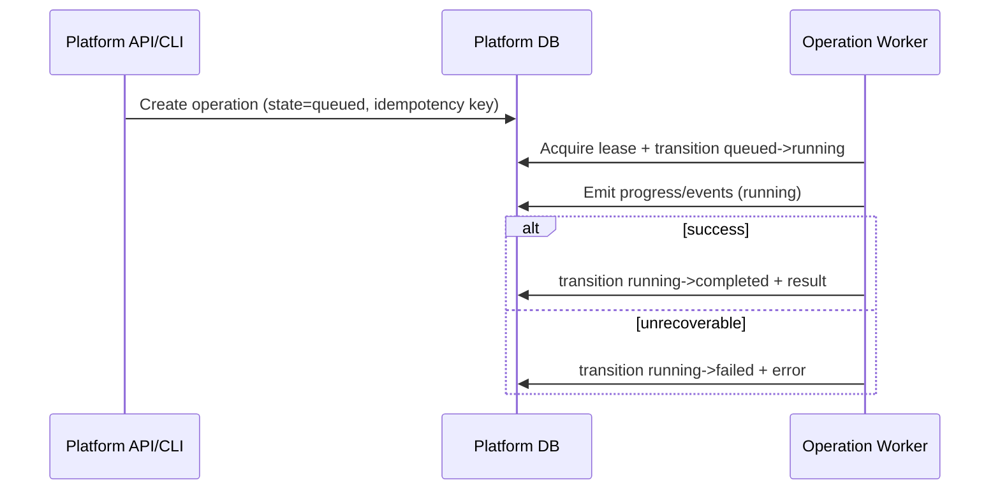
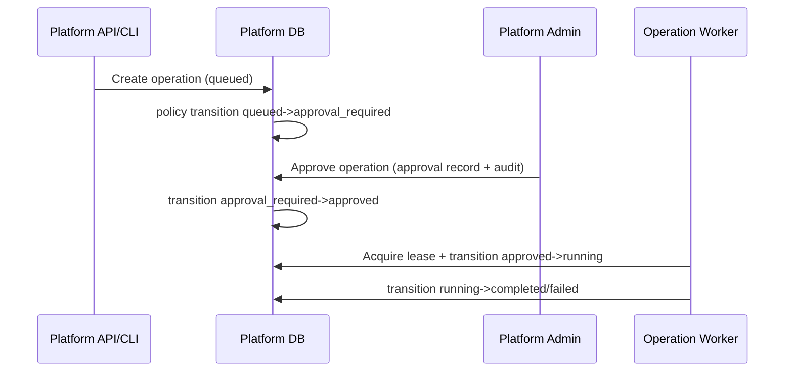

# Platform Operation State Machine (Control Plane)

## Purpose and scope

This document defines the canonical control-plane operation lifecycle for platform-native orchestration (tenant provisioning, tenant state transitions, migration orchestration, restore/cutover, and operator remediation runs).

It applies only to platform operations persisted in the `platform` datasource and does not use tenant `workflow_*` runtime tables.

Related decision: [Platform Operation Engine Decision ADR](platform-operation-engine-decision.md).

## Canonical states

| State | Meaning | Terminal |
|---|---|---|
| `queued` | Accepted and durable; waiting for scheduler/worker dispatch. | No |
| `approval_required` | Explicit platform-admin approval is required before execution may start. | No |
| `approved` | Required approval has been granted; operation is ready to run. | No |
| `running` | Handler owns the operation lease and is actively executing/resuming. | No |
| `hold` | Temporarily paused by operator/policy; resumable without redefining intent. | No |
| `blocked` | Cannot continue due to unmet dependency/precondition (e.g., child failure, dependency lock); requires remediation or dependency completion. | No |
| `completed` | Operation finished successfully and published final result payload. | Yes |
| `failed` | Operation reached terminal failure after retry policy or irrecoverable guard failure. | Yes |
| `cancelled` | Explicitly cancelled before terminal success/failure; no further execution allowed. | Yes |

Notes:
- `hold` and `blocked` are optional but recommended to separate operator-intent pause (`hold`) from dependency/precondition stop (`blocked`).
- `approved` may be bypassed for operation types that do not require approval.

## Transition model (allowed transitions + guards)

### Transition table

| From | To | Guard / condition |
|---|---|---|
| `queued` | `approval_required` | Operation type policy requires approval. |
| `queued` | `approved` | No approval required and preflight passes. |
| `queued` | `running` | No approval required and dispatcher acquires lease immediately. |
| `queued` | `cancelled` | Operator/system cancellation before start. |
| `approval_required` | `approved` | Approved by authorized platform admin (audit required). |
| `approval_required` | `cancelled` | Request withdrawn/rejected/cancelled by authorized actor. |
| `approved` | `running` | Worker acquires active lease and revalidates preconditions. |
| `approved` | `hold` | Operator places hold before execution begins. |
| `approved` | `cancelled` | Cancelled before execution begins. |
| `running` | `completed` | Handler finished and postconditions verified. |
| `running` | `failed` | Terminal error or retries exhausted. |
| `running` | `blocked` | Dependency/precondition becomes unsatisfied at runtime. |
| `running` | `hold` | Operator/policy pause during execution. |
| `running` | `cancelled` | Cooperative cancellation checkpoint reached. |
| `hold` | `approved` | Hold removed; operation is ready to resume. |
| `hold` | `cancelled` | Explicit cancellation while on hold. |
| `blocked` | `approved` | Blocking condition cleared; resume is authorized. |
| `blocked` | `failed` | Remediation timeout/SLA expired or policy marks unrecoverable. |
| `blocked` | `cancelled` | Explicit cancellation. |

Terminal-state invariants:
- `completed`, `failed`, and `cancelled` are immutable terminal states.
- Any transition from a terminal state is invalid except no-op replay of the same terminal state for idempotent write safety.

### Minimal sequence (no approval required)

### Minimal sequence (approval required)

## Idempotency key model

Each operation request must include a deterministic idempotency tuple:

- `operation_type` (required)
- `tenant_id` (nullable for global ops; required for tenant-scoped ops)
- `idempotency_key` (required client-provided or server-derived stable key)
- `idempotency_scope` (recommended: `platform`, `tenant`, or custom resource scope)

Expected behavior:
1. Unique constraint on active dedupe window: `(operation_type, tenant_id, idempotency_scope, idempotency_key)`.
2. If duplicate create request arrives:
   - Return existing operation if payload hash/resource target matches.
   - Reject with conflict if key matches but semantic payload hash differs.
3. Dedupe window retention should outlive retry windows and expected client replay horizon.

Recommended payload hash fields:
- target resource identity,
- requested action parameters,
- requested version/checkpoint when applicable.

## Lock ownership and stale lock handling

Execution is lease-based. Only the lease owner may mutate `running` operation progress/state.

Required lock/lease fields (either dedicated lock table or inline lease columns):
- `lease_owner` (worker id),
- `lease_token` (opaque random token, rotates on reacquire),
- `lease_acquired_at`,
- `lease_expires_at`,
- `heartbeat_at`.

Rules:
1. Lease acquisition is atomic with transition into `running`.
2. Heartbeat updates extend `lease_expires_at`.
3. State/progress writes require matching `(operation_id, lease_token)` guard.
4. If heartbeat stops and `lease_expires_at` passes, operation becomes recoverable by another worker.
5. Recovered operations append an audit event for stale-lease takeover, including prior/new owner ids.
6. Recovery must be idempotent: resumed handler replays from persisted checkpoint/progress, not from implicit in-memory state.

### Current KMP implementation

Tenant-scoped destructive operations (`tenant_backup`, `tenant_restore_cutover`, `tenant_migrate`, `tenant_rotate_db_secret`, and tenant status transitions) use platform table `tenant_operation_locks` with one active row per tenant. The lock row stores `operation`, `owner`, `lease_token`, `lease_acquired_at`, `lease_expires_at`, and `heartbeat_at`. When a lease is stale (`lease_expires_at` elapsed or heartbeat stale), the next acquire atomically reclaims it and records `stale_recovered_at`.

## Progress, status, error, and result payload expectations

Operation records and events should use structured JSON payloads with stable keys.

### Progress payload (non-terminal updates)

Minimum fields:
- `phase` (string, machine-readable),
- `message` (string, operator-readable),
- `percent` (number 0-100, nullable when unknown),
- `checkpoint` (string/integer monotonic marker),
- `updated_at` (timestamp).

### Error payload (`failed` or blocked diagnostics)

Minimum fields:
- `code` (stable machine-readable error code),
- `message` (safe summary),
- `retryable` (boolean),
- `category` (validation/dependency/transient/external/internal),
- `details` (sanitized object; no secrets),
- `occurred_at` (timestamp).

### Result payload (`completed`)

Minimum fields:
- `summary` (human-readable outcome),
- `artifacts` (ids/links to created resources, backups, reports),
- `metrics` (durations/counts),
- `completed_at` (timestamp).

Payload constraints:
- No secrets, credentials, connection strings, or raw PII.
- Large artifacts/logs should be referenced by identifier, not embedded inline.

## Audit correlation id requirements

Every operation must carry a `correlation_id` that is:
- generated at operation creation if not provided,
- immutable for the operation lifecycle,
- propagated to all child jobs/events/logs and external calls where supported.

Requirements:
1. `correlation_id` included on operation row and every operation event.
2. Approval/cancel/retry/resume actions must record actor id + correlation id.
3. Tenant-facing side effects generated by platform operations must log both `correlation_id` and affected `tenant_id`.
4. Correlation id format should be globally unique (UUIDv7/ULID recommended).

## Child-job model for all-tenant migration orchestration

For `--all-tenants` migration and similar fan-out operations:

1. Create one parent platform operation (`operation_type=tenant_migrate_all`).
2. Enumerate target tenants at start into immutable child jobs (snapshot semantics).
3. Create one child operation/job per tenant with:
   - `parent_operation_id`,
   - `tenant_id`,
   - child state machine using the same canonical states.
4. Parent progress aggregates child counts by state (`queued/running/completed/failed/...`).
5. Parent completion policy (explicit per operation type):
   - `all_success_required` (parent fails on any child failure), or
   - `partial_success_allowed` (parent completes with failure summary).
6. Parent cancellation:
   - Stops enqueueing new children,
   - Requests cooperative cancellation for running children,
   - Final parent state determined by policy (`cancelled` vs `failed` with partials).
7. Parent result includes per-tenant outcome summary and retry recommendations.

## Minimal schema adjustments now vs planned deltas

### Immediate implementation in this task

`tenant_operation_jobs` now carries a compatibility-first subset of the platform-native model:

- lifecycle state columns: `state` (canonical) and legacy `status` (kept in sync),
- idempotency metadata: `idempotency_scope`, `idempotency_key`,
- lease metadata: `lease_owner`, `lease_token`, `lease_acquired_at`, `lease_expires_at`, `heartbeat_at`,
- progress/status metadata: `progress_percent`, `status_message`, `progress_json`,
- structured payloads: `result_json`, `error_json` (legacy `result` and `error_message` still retained),
- explicit parent-child linkage for fan-out operations: `parent_tenant_operation_job_id` (nullable self-reference),
- correlation and runtime metadata: `operation_correlation_id`, `operation_image`, `operation_version`.

`tenant_operation_locks` now provides tenant-level lease ownership for destructive operations and stale-lock recovery without relying on cache-local mutexes.

This keeps existing console/UI paths functional while enabling state-machine-aware workers to land incrementally.

### Planned schema deltas (explicit)

When implementing the engine, add platform-datasource tables/columns equivalent to:

1. `platform_operations`
   - identity: `id`, `operation_type`, `tenant_id` (nullable), `parent_operation_id` (nullable),
   - lifecycle: `state`, `attempt_count`, `max_attempts`, `queued_at`, `started_at`, `finished_at`,
   - idempotency: `idempotency_scope`, `idempotency_key`, `request_hash`,
   - audit: `correlation_id`, `requested_by`, `approved_by` (nullable), `cancelled_by` (nullable),
   - lease: `lease_owner`, `lease_token`, `lease_acquired_at`, `lease_expires_at`, `heartbeat_at`,
   - payloads: `progress_json`, `error_json`, `result_json`.

2. `platform_operation_events`
   - `id`, `operation_id`, `event_type`, `from_state`, `to_state`, `actor_type`, `actor_id`,
   - `correlation_id`, `payload_json`, `created_at`.

3. `platform_operation_children` (or represent children directly in `platform_operations` via `parent_operation_id`)
   - parent-child linkage and optional ordering/partition metadata.

4. Indexes/constraints
    - idempotency unique index (as defined above),
    - lookup indexes for `(state, operation_type, queued_at)`,
    - lease expiry index for stale-lock scavenging,
    - foreign keys for parent/child and event relationships.

## Platform Admin operation dashboard references

The Platform Admin UI now exposes operation queue views at:

- `/platform-admin` (global queue with tenant filter)
- `/platform-admin/tenants/{slug}` (tenant-scoped queue)

Dashboard rows include state, progress, lock/stale indicators, correlation id, parent/child linkage details, created/started/heartbeat/lease/completed timestamps, and summarized output/error payloads.  
Approve/reject/retry/cancel controls are rendered with explicit disable reasons when not applicable for the current state.

## Cross references

- ADR: [Platform Operation Engine Decision](platform-operation-engine-decision.md)
- Multi-tenancy architecture: [3.9 Multi-Tenancy Architecture and Operations](../3.9-multi-tenancy.md)
- Deployment operations guide: [Deployment Overview](../deployment/README.md)
- Tenant topology/runbook context: [Tenant Database Topology](../deployment/tenant-database-topology.md)
- Release go/no-go gating: [Production Readiness Checklist](../deployment/production-readiness-checklist.md)
